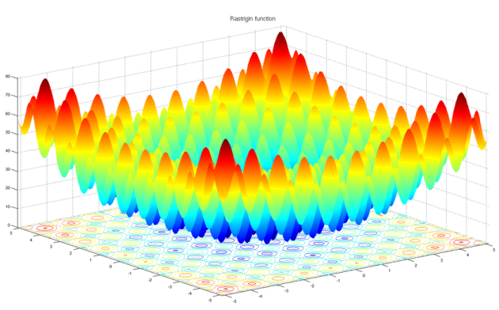

# Particle Swarm Optimization

This program uses a vanilla particle swarm optimzation algorithm to search for the global minimum value of a 30-dimension rastrigin function.

### Rastrigin Function

This function is a popular test subject for many optimization algorithms, as it has many local-minimum values that can often trap simplistic hill-climbing algorithms into a suboptimal value, rather than finding the global-minimum value located at the center of the function:

The image displays a 2-dimension rastrigin function for visualization purposes, however the actual program utilizes a 30-dimension rastrgin function, which cannot be visualized, hence no graphical components are provided with the program.

### Usage

Simply set the parameters inside PSO.java, or use the defaults provided, and run the file. After the computation has finished, the mean, median and standard deviation of the particles will be printed. The RandomSearch.java is also a stand-alone benchmarking program, which simply does a random search over the rastrigin function. It was used to benchmark the performance of the particle swarm optimization algorithm.